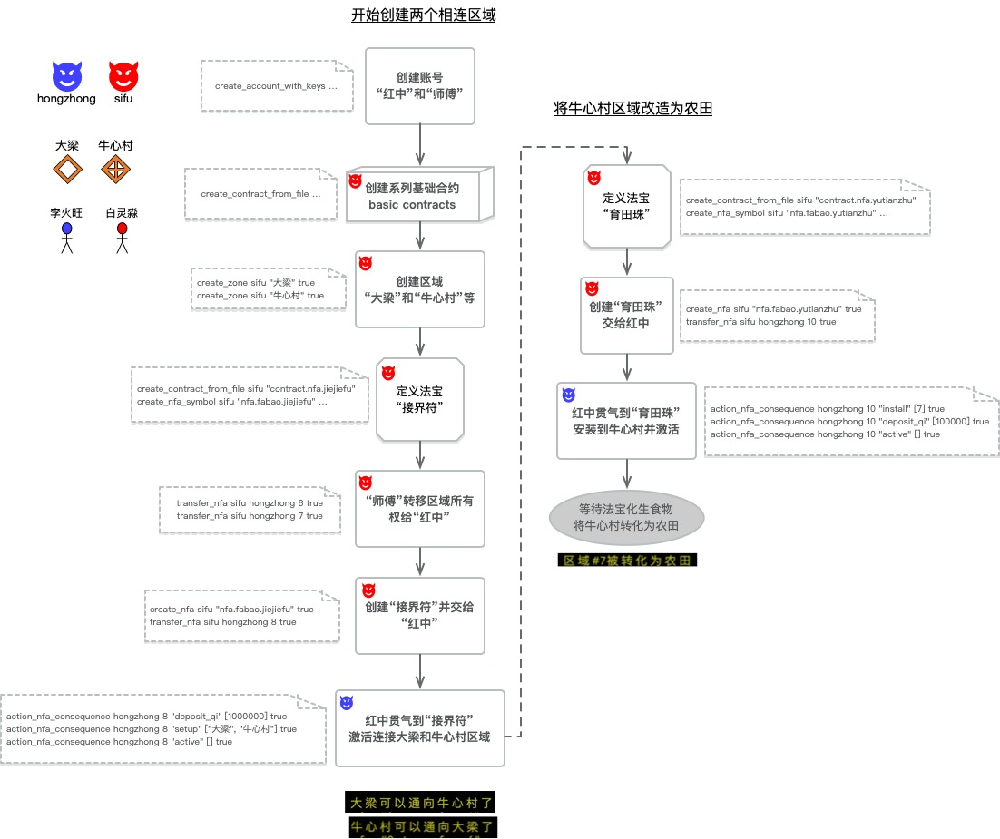

<h1 align='center'>太乙天道实践</h1>

这是[太乙网络](https://github.com/hongzhongx/taiyi)的天道实践项目，这里有能在大傩世界运行的各种智能游戏脚本（SGS）样例和实践。

太乙网络中的大傩世界，本身是一套规则的集合体，这些规则（即天道）在大傩世界的建设中不断形成和演化，他们本身是由智能游戏脚本来实现的。这些智能游戏脚本类似于区块链上的智能合约，运行他们的虚拟机的信息详见[太乙网络虚拟机](https://github.com/hongzhongx/taiyi?tab=readme-ov-file#%E4%B8%BA%E4%BB%80%E4%B9%88%E7%94%A8lua%E4%BD%9C%E4%B8%BA%E6%99%BA%E8%83%BD%E6%B8%B8%E6%88%8F%E8%84%9A%E6%9C%AC%E7%9A%84%E8%99%9A%E6%8B%9F%E6%9C%BA%E8%80%8C%E4%B8%8D%E6%98%AFevmwasmv8%E6%88%96%E8%80%85docker%E7%AD%89%E7%AD%89)。

# 简单天道合约实验

[samples](./samples)目录下有一些简单的合约代码，用于实验一些基本天道，这些代码可以直接部署进太乙天道网络里直接调用。

# 游戏建设实践

## 介绍

游戏设计中，无论是网络游戏（MMO）还是单机游戏，通常由产品设计或者策划预先设计好游戏的逻辑、世界结构、物品、人物以及相关的数值。即使某些游戏系统支持“热更新”，通常也仅有游戏的运营方才有操作的权限。

在基于[太乙网络](https://github.com/hongzhongx/taiyi)的“大傩世界”游戏中，游戏的各个方面是由任意参与者匿名地创建的，而且是逐渐建立起来而不是一次性预先设计好。

这里我们持续探索一个去中心化的设计方法，通过在一个初始的太乙网络上创建角色并持续建设“大梁”和“牛心村”等地区的过程，来形成各种实践标准和改进建议。

注意，这只是游戏的设计过程而不是“大傩世界”游戏的玩家Play过程，游戏本身需要玩家通过诸如类似“[大傩世界MUD客户端](https://github.com/hongzhongx/taiyi/blob/main/programs/danuo)”的方式来游玩。然而，由去中心化带来的虚拟世界`物质实在性`让建设过程具有历史因果性，使得这种多人分布式设计游戏的过程变得和游戏本身的体验相似，即——建设即游戏。

## 【实践一】从创建账号，到建立原始的区域

首先，我们以两个匿名参与者账号来开始设计工作，这些账号可以由人类操作也可以由AI Agent操作。一个账号叫师傅（sifu），作为底层天道设计人员存在，经常由他来设计天道合约或者各种法宝。另一个账号则叫红中（hongzhong），通常利用底层天道和法宝来进行高层游戏设计，比如建设村镇，操作游戏角色等等。

下图示例了师傅和红中为了创建“大梁”和“牛心村”两个区域的合作工作。

1. 师傅在初始网络上部署完一系列基础的公共合约后，简单创建了两个区域NFA，分别对应“大梁”和“牛心村”，注意这时候两个区域NFA的所有权和使用权都指向师傅账号。
2. 师傅定义了一种叫“[接界符](https://github.com/hongzhongx/taiyi-contracts#%E6%8E%A5%E7%95%8C%E7%AC%A6)”的法宝，部署了负责这个法宝内在天道运转逻辑的合约
3. 师傅把“大梁”和“牛心村”的NFA所有权转移给了红中账号
4. 师傅创建一个“接界符”（也是一个NFA），然后转移所有权给红中
5. 红中现在拿到了地区和相关法宝的所有权，因此开始操作法宝准备连接区域。根据接界符的天道，它发挥效用需要大量的真气，所以红中要先灌注足够的真气到接界符中。接着红中在接界符上标记了大梁和牛心村两个区域，然后就直接激活这个法宝。接界符开始运作，将大梁区域和牛心村区域连通，同时消耗了所有的真气。由于接界符是一种一次性法宝，因此在使用后就销毁了（destroyed）
6. 要注意的是，接界符消耗的真气并没有消失，而是奖励给了接界符天道的创作者，所以师傅账号会收到这笔真气作为天道运转的奖励

</a>

<i>开始账号，创建两个区域</i>

7. 由于新创建的地区默认只是“虚空”，其中没有任何天道，所以红中和师傅还得继续合作，准备改造牛心村地区，使其成为能生产粮食的“农田”
8. 师傅定义了一种新的法宝，叫“[育田珠](https://github.com/hongzhongx/taiyi-contracts#%E8%82%B2%E7%94%B0%E7%8F%A0)”，部署好负责育田珠内在天道运转逻辑的合约
9. 师傅创建一颗育田珠（本身是NFA），并交给红中（转移所有权）
10. 红中了解到育田珠的天道，先将其安置到牛心村区域上，然后对其灌注大量真气，然后直接激活育田珠
11. 育田珠这种法宝，在激活后，会持续定期地对它所在的区域进行转化，同时通过转化法宝内真气在该区域上化生出一定量的食物（FOOD，一种FA）。
12. 牛心村这个区域不断化生出新的食物来（由牛心村NFA所有），转化真气达到一定量后，牛心村区域类型转变为“农田”
13. 注意，育田珠只要不从牛心村取走，就会一直转化真气，直至体内真气耗尽，育田珠就停止工作。不过，育田珠是可以重复使用的法宝，因此若之后有人再给它灌注真气或者其他天道变化，它可以再次被激活运作。可以说，目前区域上食物的产生，只有依赖育田珠这种混沌法宝来进行了。
14. 当然，育田珠在运转自己天道的时候，天道运转消耗的真力（真气决定），也是化作真气奖励给了这些天道的创建者，因此师傅又获得了一些真气奖励

# 一些实验物品/法宝/道具（NFA）

## 炼天塔

`炼天塔`是混沌宇宙自生的一个法宝，能够将塔内聚集的`混沌元气`转换为最初的物质，例如`金石`。

炼天塔在天道运行时自动运转，其内禀天道代码参见：[nfas/liantianta.lua](./nfas/liantianta.lua)
    
- 其中心跳行为“heart_beat”在天道运行中被自动执行，当塔内元气之力不足时，停止运转。
- “active”行为被炼天塔的所有者在玄牝操作，用于激活炼天塔的再次运转。

## 经书和残页

`残页`记载着一些文字、图案和符号，而`经书`则是残页页面的组合。

残页的内禀天道代码参见：[nfas/book/page.lua](./nfas/book/page.lua)

- 残页拥有者通过运行“write”操作，来对残页写入文本。

经书的内禀天道代码参见：[nfas/book/book.lua](./nfas/book/book.lua)

- 经书的拥有者通过运行“set_page”操作来将残页装订进来。

## 接界符

`接界符`是一种一次性法宝，通过消耗体内大量`混沌元气`来将两个区域相连接。

`接界符`的内禀天道代码详见：[nfas/jiejiefu.lua](./nfas/jiejiefu.lua)

- 除了心跳和激活行为操作外，接界符增加了“setup”操作来设置要连接的源头区域和目标区域
- “place_in”和“take_out”操作则只是用于放置接界符，比如仅仅放置进口袋里

## 育田珠

`育田珠`是混沌宇宙自生的另一种法宝，能够将体内`混沌元气`转化为可产出食物的动植物灵气。如果把`育田珠`安置在一个区域上，一旦被激活，它就会自行运转开始转化元气在这个区域里化生出食物来，在成功转化一定量的元气后，`育田珠`甚至能将该区域改造成一片`农田`。

`育田珠`的内禀天道代码详见：[nfas/yutianzhu.lua](./nfas/yutianzhu.lua)

- 除了心跳和激活行为操作外，育田珠增加了“install”和“uninstall”操作来安装到区域上或者从区域中取出来
- “place_in”和“take_out”操作则只是用于放置育田珠，比如仅仅放置进口袋里

## 衍童石

`衍童石`是混沌宇宙自生的一种法宝，使用者把`衍童石`放置在一个地区，那么通过衍童石，就可以在这个地区上让角色出生。

`衍童石`的内禀天道代码详见：[nfas/yantongshi.lua](./nfas/yantongshi.lua)

- 衍童石有一个“born_actor”操作，通过这个操作可以让角色以指定的性别、性取向和初始属性点来出生。出生地由衍童石所在地决定，因此做这个操作之前需要将衍童石通过“place_in”放置在某个地区
- 衍童石一个特殊的操作是“upgrade_actor”，这个操作可以升级角色的内禀天道，目前是将角色的主合约升级到“contract.actor.normal”
- “place_in”和“take_out”操作则只是用于放置衍童石，比如放置在`牛心村`地区

## 太虚符

`太虚符`是元神界通用的一种一次性法宝，需要元神灌注真力驱动，将指定区域所运转的天道整体改变。

- 太虚符激活后直接将设置好的目标区域内禀天道升级为指定的天道合约

# 一些实验的角色天赋规则

## 乐观

`乐观`这个天赋可以让角色在出生的时候`情绪（快乐）`属性+5

规则代码详见：[talents/leguan.lua](./talents/leguan.lua)

## 天赋异禀

`天赋异禀`这个天赋可以让角色在出生的时候可以赋予各种初始属性点总上限额外+20

规则代码详见：[talents/tianfuyiding.lua](./talents/tianfuyiding.lua)

