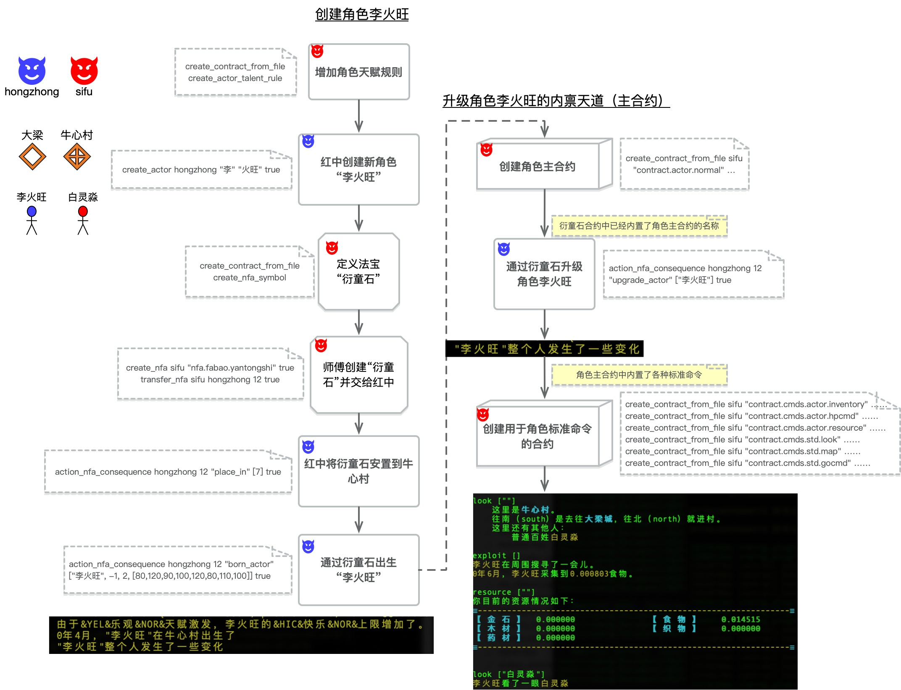

# 【实践二】创建角色“李火旺”，并且在牛心村出生

经过实践一，当前世界有了原始的区域和一些基础天道（SGS合约）支持，接下来我们试着创建玩家能操作的角色，并且让他在这个世界诞生。

下图示例了师傅和红中在[实践一](https://github.com/hongzhongx/taiyi-contracts?tab=readme-ov-file#%E5%AE%9E%E8%B7%B5%E4%B8%80%E4%BB%8E%E5%88%9B%E5%BB%BA%E8%B4%A6%E5%8F%B7%E5%88%B0%E5%BB%BA%E7%AB%8B%E5%8E%9F%E5%A7%8B%E7%9A%84%E5%8C%BA%E5%9F%9F)的情况下创建新角色“李火旺”，并且让他在牛心村出生。

</a>

<i>创建角色“李火旺”，并让他在“牛心村”出生</i>

1. 师傅设计了两种可以用于角色的“天赋”，例如“[乐观](../talents/leguan.lua)”和“[天赋异禀](../talents/tianfuyiding.lua)”。如果角色在被创建的时候随机被赋予了某个天赋，则相关条件下天赋会被触发。比如“乐观天赋”在角色出生的时候能增加心情上限，而“天赋异禀”则能在角色出生时提供更高的总体属性上限
2. 红中运用玄牝工具创建新角色“李火旺”，创建时指定姓和名。角色在创建时会被随机赋予一些天赋
3. 这种没爹没娘的空降角色不能自己出生，需要借助法宝来化生。这里师傅设计了一种新法宝叫做“[衍童石](https://github.com/hongzhongx/taiyi-contracts?tab=readme-ov-file#%E8%A1%8D%E7%AB%A5%E7%9F%B3)”，用于出生这种天降角色
4. 师傅制作了一块“衍童石”并且交给红中
5. 红中拿到衍童石后，通过玄牝工具调用NFA指令，将衍童石安置在牛心村区域
6. 红中通过玄牝工具调用衍童石的`诞生角色`指令，让李火旺这个角色在牛心村出生。指令可以指定出生时候的性别和性取向，还可以指定具体的各项属性，当然这些属性的总和不可以超过角色创建时候的属性总值上限。图中的属性加起来是820，这是在创建李火旺的时候随机到了“天赋异禀”天赋，这个天赋会导致角色属性总值上限增加20
7. 现在的李火旺，只是一个完全虚无的角色，内在的天道（SGS主合约）也是系统的默认合约，几乎没有什么可以和他交互的。因此需要对这个角色进行首次升级，成为一位基本的人类。这里，作为示例，师傅设计了一个人类角色所具有的内禀[主合约](../nfas/actors/normal.lua)，出于示例的考虑，这个合约具有一些基本的天道，例如可以“看（look）”的能力、可以“走（go）”的能力，还有一些诸如“查询状态（hp）”等基础交互能力。这样大傩玩家通过danuo客户端才可以对李火旺进行基本的操作
8. 法宝衍童石还有一个特色能力，就是有个指令可以升级角色到指定的SGS合约。这里红中通过衍童石来升级了李火旺的主合约到示例合约
9. 师傅接着花费了很多天才补全了角色主合约中各种操作的具体设计。注意：这一步和上一步没有顺序关系，目前这个顺序纯粹是因为师傅和红中进行首次实践合作的时候就是这个顺序（第7步合约中的很多细节操作，都是师傅在很久之后陆陆续续实现的，因此不是在第7步就搞定的）
10. 下图中最右下的一个截屏是红中作为实际玩家在danuo客户端接入后，操作李火旺的实际交互（danuo实验客户端目前是MUD形式）
