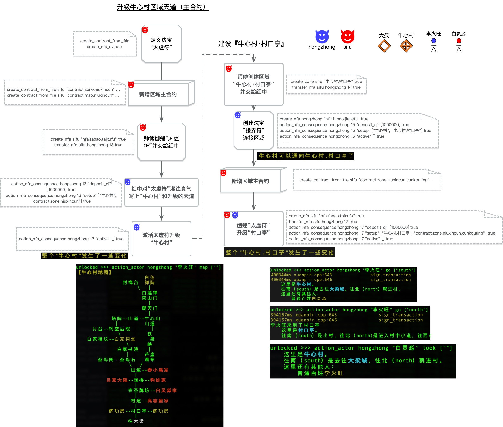

# 【实践三】升级“牛心村”，并创建牛心村入口“村口亭”

经过实践一和实践二，当前世界不仅有了原始的区域和一些基础天道（SGS合约），也诞生了能够操作的玩家角色（例如李火旺）。

下图示例了师傅和红中在[实践一](https://github.com/hongzhongx/taiyi-contracts?tab=readme-ov-file#%E5%AE%9E%E8%B7%B5%E4%B8%80%E4%BB%8E%E5%88%9B%E5%BB%BA%E8%B4%A6%E5%8F%B7%E5%88%B0%E5%BB%BA%E7%AB%8B%E5%8E%9F%E5%A7%8B%E7%9A%84%E5%8C%BA%E5%9F%9F)和[实践二](https://github.com/hongzhongx/taiyi-contracts?tab=readme-ov-file#%E5%AE%9E%E8%B7%B5%E4%BA%8C%E5%88%9B%E5%BB%BA%E8%A7%92%E8%89%B2%E6%9D%8E%E7%81%AB%E6%97%BA%E5%B9%B6%E4%B8%94%E5%9C%A8%E7%89%9B%E5%BF%83%E6%9D%91%E5%87%BA%E7%94%9F)的情况下，进一步对牛心村区域进行升级，增加地图，并且连通村口亭进行实验。

</a>

<i>升级“牛心村”，创建“村口亭”</i>

1. 师傅设计一种新的法宝“[太虚符](https://github.com/hongzhongx/taiyi-contracts?tab=readme-ov-file#%E5%A4%AA%E8%99%9A%E7%AC%A6)”，这种一次性法宝可以对设置的区域升级它的内禀天道（主合约）。这个功能和“[衍童石](https://github.com/hongzhongx/taiyi-contracts?tab=readme-ov-file#%E8%A1%8D%E7%AB%A5%E7%9F%B3)”升级角色天道的功能异曲同工
2. 师傅接着设计了一些特色天道来准备成为“牛心村”的主合约，从而让我们能有针对性地进行实验交互，其中还包括了一副牛心村的详细地图
3. 师傅炼成一张太虚符并交给红中
4. 红中对太虚符灌注真气，然后写上“牛心村”和要升级的天道（第二步师傅准备的）
5. 红中激活太虚符，太虚符在接着的第一个内循环周期中对牛心村区域的天道进行了升级。这一步后，在MUD客户端（danuo），玩家可以运行自身天道中的look、map等命令来查看情况。例如玩家李火旺用了map命令，接合牛心村天道中的反馈，可以看到牛心村的地图（如图中左下角截屏）。玩家白灵淼使用look命令，也可以查看当前所在牛心村的情况（如图中右下角截屏）
6. 接下来，师傅和红中准备进一步建设牛心村细节了，按地图所示，先建设村口亭。师傅创建了一个村口亭的区域交给红中（区域初始都是虚空区域）
7. 和[实践一](https://github.com/hongzhongx/taiyi-contracts?tab=readme-ov-file#%E5%AE%9E%E8%B7%B5%E4%B8%80%E4%BB%8E%E5%88%9B%E5%BB%BA%E8%B4%A6%E5%8F%B7%E5%88%B0%E5%BB%BA%E7%AB%8B%E5%8E%9F%E5%A7%8B%E7%9A%84%E5%8C%BA%E5%9F%9F)一样，红中直接炼成一张“[接界符](https://github.com/hongzhongx/taiyi-contracts#%E6%8E%A5%E7%95%8C%E7%AC%A6)”，将牛心村和村口亭这两个区域进行双向连接。这就打通了牛心村这个大范围到村口亭这个牛心村入口的逻辑通道
8. 师傅为村口亭设计了有针对性的区域天道合约 
9. 和第3步到第5步一样，师傅和红中合作用太虚符升级了村口亭这个区域。至此，玩家李火旺可以尝试用角色的go命令，在牛心村和村口亭之间来回移动了（图中左下方截屏）
