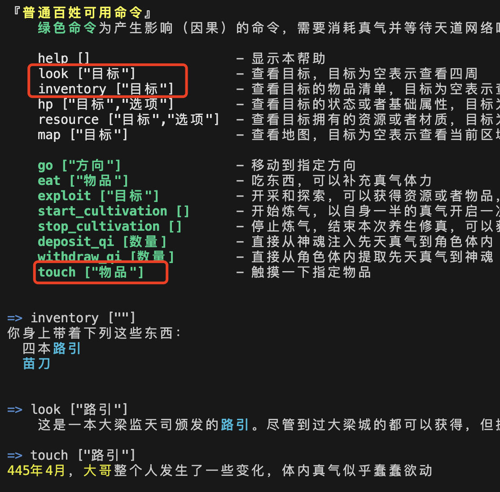
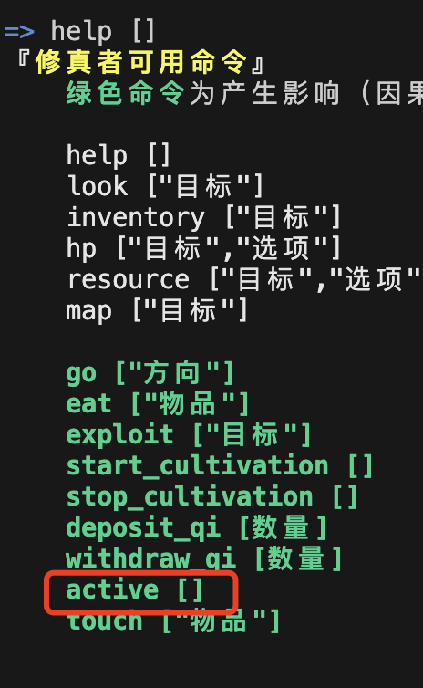
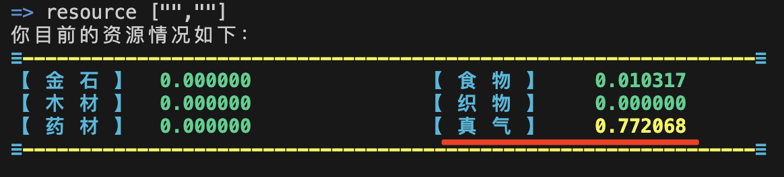

# 【实践四】让“普通百姓”升级到“修真者”

这次，通过对[普通角色的主逻辑天道代码](../nfas/actors/normal.lua)进行升级，再对之前的一个物品“[路引](../nfas/luyin.lua)”进行编程，使得普通百姓角色通过触摸这个路引就能升级为一种新的角色，[能自动修真的修真者](../nfas/actors/cultivator.lua)。

以下的截屏均为从“[大傩世界MUD客户端（简称danuo）](https://github.com/hongzhongx/taiyi/blob/main/programs/danuo)”直接看到的输出。

## 普通百姓直接触摸“路引”来升级

</a>

<i>普通角色的help命令</i>

- 在公共的测试网络上，普通角色（普通百姓）可以用命令 help 查看自己身上可以执行哪些命令
- 比较有意思命令的是“`start_cultivation`”和“`stop_cultivation`”，字面意思看得出来就是修真。玩家可以在任何时候通过“start_cultivation”来启动一个修真活动，目前的实现很简单，就是用玩家身上一半的真气开始修真，然后在一段时间后，玩家通过“stop_cultivation”来结束这次修真，可以概率性收获一定数量的新真气。修真的活动属于底层天道，在[天道共识层](https://github.com/hongzhongx/taiyi)进行了实现，其理论参考[真气守恒定律](https://github.com/hongzhongx/taiyi/blob/main/doc/zhenqishouheng.md)。鉴于测试网络的实验目的，当角色的健康小于10的时候，也可以通过修真直接恢复到满血，这可以从修真实现的[C++代码](https://github.com/hongzhongx/taiyi/blob/main/libraries/chain/database_cultivation.cpp#L167)中看到。
- 通过 `inventory` 命令可以查看角色身上带有什么东西，本实践要求玩家身上要有一个物品“路引”。如果没有路引的话，在写作这篇实践记录的时期，测试网上的玩家可以去趟大梁，大梁城的主逻辑会自动让来到的角色获得物品“路引”
- 如果身上有路引这个物品，`look [“路引”]` 可以看到路引的详细说明
- 可以看到，角色身上有一个 `touch` 命令，普通百姓使用 `touch [“路引”]` 就可以触摸路引这个物品，而路引的主逻辑中，对touch是有响应的，作为实验，响应的天道是直接让触摸者升级到修真者
- 一旦触摸过路引，角色（Actor）对应实体（NFA）的主合约，就会升级为[cultivator合约](../nfas/actors/cultivator.lua)

## 修真者激活自体真气运转

</a>

<i>修真者角色的help命令</i>

- 玩家角色作为修真者时，运行help命令可以看到，比普通百姓多了一个可以执行的命令“`active`”
- 修真者使用 `active []` 后就可以激活体力真气自动运转内气天道。随着年龄长大，角色的健康上限会下降，如果 `health` 为0的话，角色就去世了。这时候如果你体内还有真气，那么这个自动运转的天道就会帮你激活修真活动，以恢复 health。由于测试网模拟时间太快，岁数很快就超过 80 岁，健康就会迅速下降，之前建设初期，很多普通百姓一晚上自己就死了，现在，有了自动修真的能力，就在测试网络上实现了修真者的自动不死
- 修真者自动运转的内气天道，在自身真气小于1000000的时候，也会激活修真活动，然后在大约10分钟后结束修真并收获真气，以此自动修炼，保持自身真气的充裕

</a>

<i>修真者激活后，就会自动运转内息</i>

- 可以想到，内息运转的天道未来可能多种多样，实际上就会形成不同的内气修炼功法
- 值得注意的是，如果体内真气已经很少了，修真者角色可能就 active 不起来。由于没有真气就无法行动，甚至连start_cultivation都不能执行，这时候也会出现眼看岁数增加健康归零而救不活角色的情况。遇到这种情况，只能使用 `deposit_qi` 强行从神魂账号灌注真气到角色实体
- 角色可以使用命令 `resource [“”,“”]`，随时查看体内的真气情况

</a>

<i>角色执行resource命令</i>

