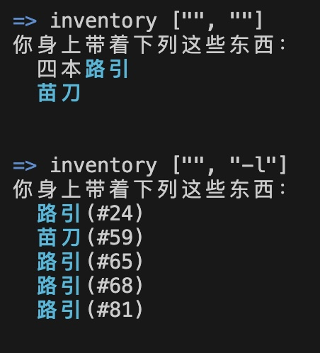
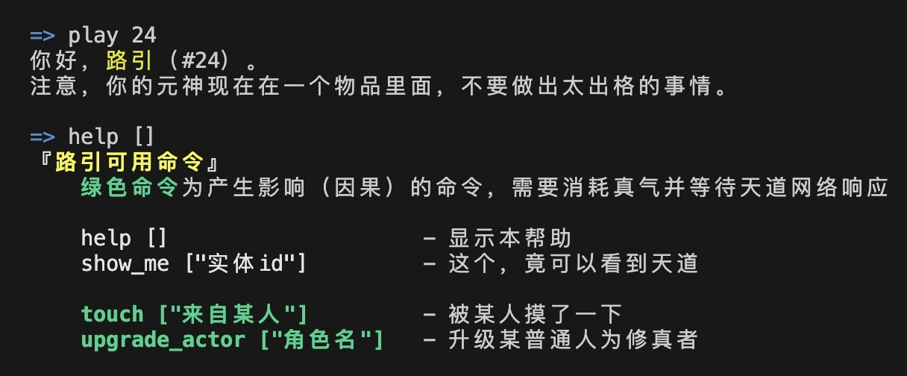
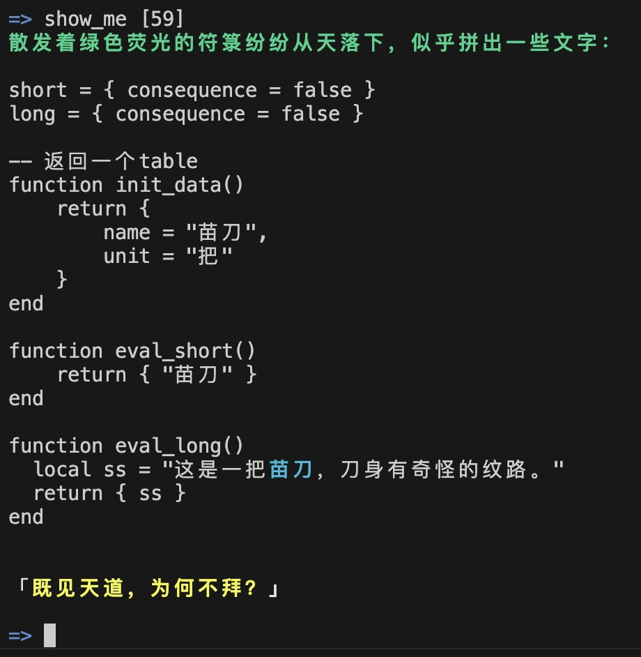

# 【实践五】升级“路引”，窥探天道

实现了一个彩蛋，通过对[普通角色的主逻辑](../nfas/actors/normal.lua)和[修真者主逻辑](../nfas/actors/cultivator.lua)进行升级，再对之前的“[路引](../nfas/luyin.lua)”进行升级，在神魂夺舍（账号接入）路引后，可以通过运行一个命令来查看任何实体的主合约天道代码。

以下的截屏均为从“[大傩世界MUD客户端（简称danuo）](https://github.com/hongzhongx/taiyi/blob/main/programs/danuo)”直接看到的输出。

## “inventory”命令升级，可以获取实体id

直接在线修改了角色逻辑代码，对`inventory`命令进行了升级，现在查看物品的命令`inventory`增加“-l”参数，可以详细列出物品和相应的实体id。

</a>

<i>角色的inventory命令</i>

## “夺舍”路引

在物品“路引”上，继续推进“多层世界”的实验，准备进入“路引”这个物品的视角。路引这个物品本身也在逐渐增加它自己的命令。

</a>

<i>“路引”的help命令</i>

- 如果角色拥有“路引”，你可以用`play id`命令来接入它（**夺舍**），之后命令界面将进入“路引”这个物品的子世界视角，你再使用`help`命令出来的就是作为路引可以操作的动作列表了。
- 可以看到，在路引身上有绿色的触摸（touch）和升级修真者的功能命令。目前，角色（actor）身上的`touch`命令在对象为路引的情况下，实际上就是调用了路引身上的这个touch。可以参考[【实践四】让“普通百姓”升级到“修真者”](./practice04.md#实践四让普通百姓升级到修真者)

## 路引的“彩蛋”命令

通过在线升级[合约](../nfas/luyin.lua)，路引身上增加了一个彩蛋命令`show_me`。在账号接入（神魂夺舍）路引后，可以通过运行这个命令来查看任何实体的主合约天道代码。

</a>

<i>路引的show_me命令</i>

- 之所以是彩蛋，是因为在正式网络的游戏中，只能等你的角色突破了极高境界（飞升？）或者获得“心素”体质后，才能通过掌握某种功法，获得看到天道（代码）和修改天道的权限。测试网络这里，只要通过垂手可得的“路引”就可以看到了。这有点《黑客帝国》的意思了。
- 对于大傩世界的物品和实体，采用这种可编程游戏内组件的设计，这种可以接入任何物品内视角的设定，扩充了世界嵌套的层次。联想到早年的科幻电影《异次元骇客》（又叫十三层楼）。很有可能，玩家在牛心村玩了很久后，才发现结果大家也只是在另外一个小小的法宝里面吧~~
- “可编程游戏内组件”的概念还可以参考CCP新作《EVE Frontier》：[Smart Assemblies | EVE Frontier](https://whitepaper.evefrontier.com/digital-physics/smart-assemblies)
