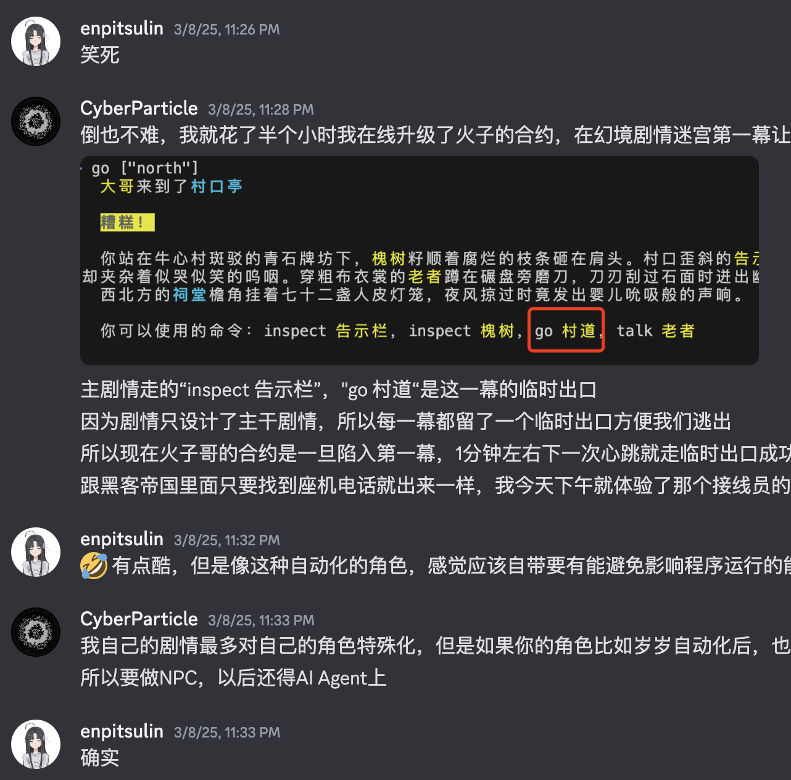
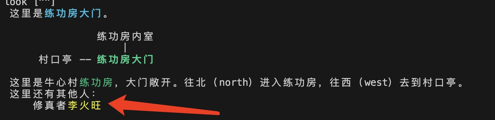
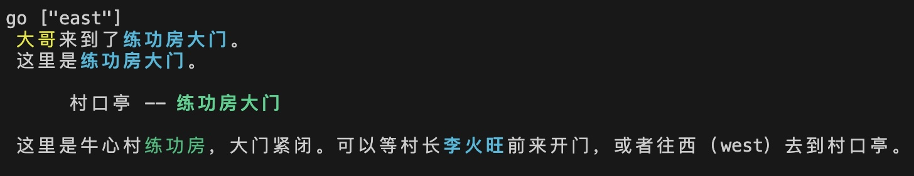
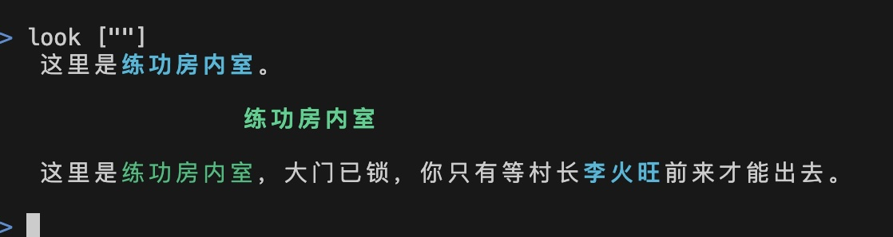
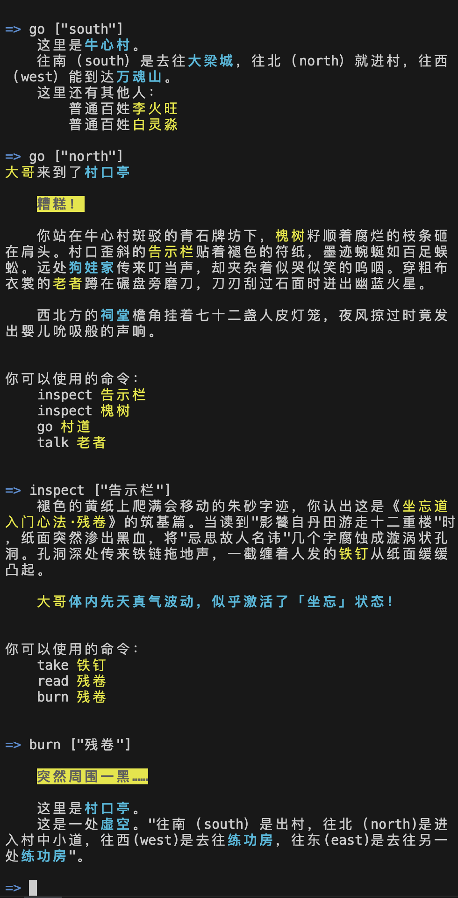
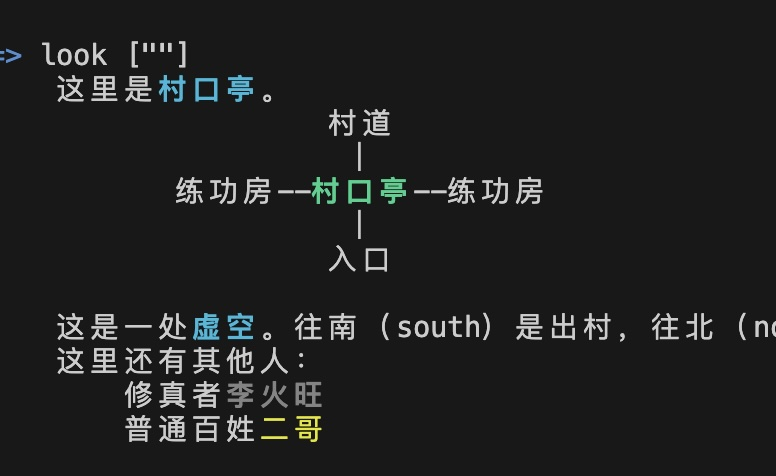

# 【实践六】拯救李火旺

本实践实际上是对一次发生在测试网络上的“真实”事件的记录。

以下的MUD截屏均为从“[大傩世界MUD客户端（简称danuo）](https://github.com/hongzhongx/taiyi/blob/main/programs/danuo)”直接看到的输出。

## 演示NPC现场出了大岔子

今年三月的一个周末，我们在线更新了第一个NPC实现，将角色李火旺升级成可以在几个地方来回巡逻的NPC。

当时，在[坐忘道Discord频道](https://discord.gg/g4f84UEGCD)给大家演示的时候，操作却出了大岔子，结果演示环节变成了现场编程拯救村长李火旺😂。

</a>

<i>演示现场崩塌</i>

## 正常NPC行为

正常情况下，升级主程序后的李火旺实体会在村口亭到练功房内室之间走动，按照目前测试网络上的时间心跳，大约1分钟左右李火旺就会换一个地方，如下图。

</a>

<i>李火旺在练功房大门</i>

练功房大门平时是上锁的，玩家如果到这里，看到上锁只有等。只有李火旺要去到内室才会打开，他离开的时候就会上锁。

</a>

<i>玩家到练功房大门不能进入，只能等待</i>

在演示的时候，大家也看到了有意思的涌现情节，比如玩家进到内室后，在李火旺离开之前没有及时出来，结果被关在练功房内室几分钟的情况，如下图。

</a>

<i>玩家在练功房内不能出去，只能等待</i>

## 遭遇“合约可组合性”问题

接下来就出事了，本来等个几分钟李火旺从村口亭再过来开门就是了，结果我们在现场等了十几分钟，火子哥迟迟不来，玩家就一直被困。发觉不对劲后，我们现场查接口，发现李火旺竟然在村口亭不动了（之前一直是正常的），原以为是bug，结果仔细查询分析李火旺角色实体（actor）的状态，发现李火旺这个“NPC”居然是坠入了村口亭的幻觉剧情。

这时我们才回想起来，年初春节的时候，我们实验了DeepSeek R1生成剧情，在村口亭规则中设置了有50%几率坠入一个幻境剧情副本，而且这个规则对所有游戏角色（actor）是一视同仁的。

也就是说，李火旺这个角色实体NFA，目前正在“体验”幻境剧情！如果李火旺这个NFA是正常的玩家角色，在接入角色的客户端上（例如danuo程序），可以在如下图所示的类似剧情中交互。然而现在这个NFA是没有任何人接入的自动NPC，他的核心天道（NFA绑定的SGS）是自动执行的，自己是没有处理幻境环境的能力。

</a>

<i>玩家通过普通角色“大哥”在村口亭进入幻境后的交互</i>

- 关于“幻境剧情”，是我们实验中的一个副本剧本，内容由DeepSeek R1生成，这个实验在[【实践七】幻觉世界（副本实践）](./doc/practice07.md)中详细介绍。

在MUD客户端的叙事界面上，对这种陷入幻觉世界的状态进行了颜色突出，玩家或者NPC会是灰色的。

</a>

<i>可以观察到，“李火旺”人是在村口亭，但是陷入了幻境</i>

由于大傩世界的司命网络，决定了因果事件是不能篡改的（比如通过回档、强制改状态、改规则、拔插头关机等等），所以我们不可能直接修改李火旺或者村口亭的“数据”。

由于村口亭本身以及幻境剧情的合约SGS是另外的道友（“师傅”账号）创作的，我们演示的时候没有幻境剧情或者村口亭的规则权限，只有李火旺的角色权限。因此大家就只有通知其他道友，在现场对李火旺的实体增加新的幻境处理行为，同时针对幻境剧情，寻找到最近的迷宫出口。

经过一番代码探测（主要是分析幻境SGS代码），计划了新的逃亡路线后（幻境中最近的迷宫出口“go 村道”），火子哥自主运行升级后的主程序成功从幻觉世界脱困，继续开始自己的NPC任务了。

## 客观实在性

区块链的效应，相当于大傩游戏世界实施了客观实在性，规则具有相当强度的“硬度”。设计人员没法直接修改规则和因果历史，只能按照当下这个世界既有的“物理规则”进行活动和破解，这种感觉很像黑客帝国中里奥（NEO）到处寻找外部“接线员”给自己设置的那部“座机电话”~~
